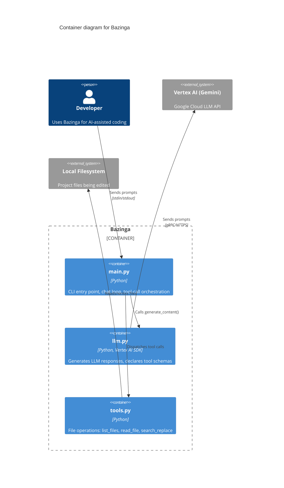

# C4 Model — Deep Research Report

> Generated: 2026-05-14 | Sources: 20+ web

## TL;DR

- **C4 = 4 zoom levels** for architecture: System Context > Container > Component > Code. You only need the first 2 for most projects.
- **Structurizr DSL** is the reference tooling — free locally via Docker, models-as-code, exports to Mermaid/PlantUML/PNG/interactive HTML. One model, many views.
- **Mermaid has C4 support** (experimental) — usable for small projects like ours, renders on GitHub/Obsidian, good stepping stone to Structurizr.
- **Scaling**: split into focused views per domain, use filtered views by tags, promote services to separate systems when teams diverge. Max ~10-15 elements per diagram.
- **For our project**: Mermaid C4 is the right starting point. Migrate to Structurizr DSL when we need multiple views from one model or auto-layout.

## Overview

The C4 model was created by Simon Brown (~2006-2011) as "maps of your code" — like Google Maps for software architecture. Inspired by UML and the 4+1 view model but deliberately simplified. It defines 4 levels of abstraction for static structure, plus supplementary diagrams for dynamic behavior and deployment.

The core insight: different audiences need different zoom levels. Non-technical stakeholders see Level 1 (big picture), developers see Level 2-3 (containers and components). Each diagram should stand alone — understandable without narration.

C4 is **notation-independent** (no prescribed shapes/colors) and **process-independent** (no opinions on agile vs waterfall). It's purely a way to describe what exists at different abstraction levels.

---

## Key Findings

### 1. The 4 Levels

#### Abstraction Hierarchy

```
Person (actor/role/persona)
  uses ->
    Software System        <- highest: delivers value to users
      made up of ->
        Container          <- runtime boundary (app, DB, queue)
          made up of ->
            Component      <- logical grouping behind an interface
              implemented by ->
                Code       <- classes, functions, interfaces
```

#### Level 1: System Context

| Aspect | Detail |
|--------|--------|
| Scope | A single software system |
| Shows | The system + people + external systems it talks to |
| Audience | Everyone (including non-technical) |
| Recommended | **Yes**, always |

#### Level 2: Container

| Aspect | Detail |
|--------|--------|
| Scope | Inside one software system |
| Shows | Applications, data stores, runtime boundaries |
| Audience | Technical people |
| Key rule | A container = something that needs to be **running** (not a JAR/DLL/package) |
| Recommended | **Yes**, always |

**Container examples**: server-side web app, SPA, mobile app, database schema, S3 bucket, serverless function, shell script.

**NOT containers**: JARs, DLLs, packages, namespaces (those are organizational, not runtime).

#### Level 3: Component

| Aspect | Detail |
|--------|--------|
| Scope | Inside one container |
| Shows | Logical groupings of related functionality |
| Audience | Architects + developers |
| Recommended | **No** — only if it adds value. Consider auto-generating. |

#### Level 4: Code

| Aspect | Detail |
|--------|--------|
| Scope | Inside one component |
| Shows | Classes, interfaces, functions, DB tables |
| Audience | Developers only |
| Recommended | **No** — most IDEs generate this on demand |

### 2. Supplementary Diagrams

| Diagram | What it shows | When to use |
|---------|--------------|-------------|
| **System Landscape** | All systems in an org (no focus on one) | Enterprise-wide map |
| **Dynamic** | Runtime collaboration for a specific feature/use-case | Complex interaction flows |
| **Deployment** | How containers are deployed to infrastructure | Prod/staging topology |

### 3. Notation Rules

Every diagram must have:
- **Title** describing type and scope
- **Key/legend** explaining all notation

Every element (box) must show:
- **Type** (Person, Software System, Container, Component)
- **Short description** of responsibilities
- **Technology** (for containers and components)

Every relationship (arrow) must:
- Be **unidirectional**
- Be **labeled** with intent (not just "Uses")
- Show **technology/protocol** for inter-container connections (e.g., "JSON/HTTPS", "JDBC")

---

### 4. Structurizr DSL — The Reference Tooling

#### What It Is
- "Models as code" tool by Simon Brown (the C4 author)
- Define architecture in a `.dsl` file → get multiple views/diagrams from one model
- Free locally, open-source (Apache 2.0)
- Monorepo: [github.com/structurizr/structurizr](https://github.com/structurizr/structurizr)

#### Product Variants

| Product | Cost | Status |
|---------|------|--------|
| Playground (playground.structurizr.com) | Free | Active |
| Local (`local` command via Docker) | Free | Active |
| Export command | Free | Active |
| Server (self-hosted, multi-user) | From 300 GBP/mo | Active |
| Cloud, On-premises, CLI, Lite | N/A | **End of life** |

#### Installation (Docker — no Java needed)
```bash
docker pull structurizr/structurizr
```

#### Minimum Viable workspace.dsl
```
workspace "My App" "Architecture" {
    model {
        user = person "User" "End user"
        app = softwareSystem "My App" "Does the thing" {
            api = container "API" "Handles requests" "Python/FastAPI"
            db = container "Database" "Stores data" "PostgreSQL" {
                tags "Database"
            }
        }
        user -> api "Uses" "HTTPS"
        api -> db "Reads/writes" "SQL"
    }

    views {
        systemContext app "SystemContext" {
            include *
            autoLayout
        }
        container app "Containers" {
            include *
            autoLayout
        }
        styles {
            element "Person" { shape Person; background #08427b; color white }
            element "Software System" { background #1168bd; color white }
            element "Container" { background #438dd5; color white }
            element "Database" { shape Cylinder }
        }
    }
}
```

#### Local Preview
```bash
docker run -it --rm -p 8080:8080 \
  -v $(pwd)/docs/architecture:/usr/local/structurizr \
  structurizr/structurizr local
# Open http://localhost:8080
```

Features: pan, zoom, double-click drill-down, diagram key, layout editor, quick navigation (Space key).
No auto-reload — edit DSL, save, refresh browser.

#### Export Formats
```bash
# Static interactive HTML site (preserves drill-down)
structurizr export -workspace workspace.dsl -format static -output static-site/

# Mermaid
structurizr export -workspace workspace.dsl -format mermaid -output mermaid/

# PlantUML (C4-PlantUML macros)
structurizr export -workspace workspace.dsl -format plantuml/c4plantuml

# JSON workspace format
structurizr export -workspace workspace.dsl -format json

# PNG/SVG (requires -playwright Docker tag)
structurizr export -workspace workspace.dsl -format png
```

#### Key DSL Features

**Implied relationships**: `user -> webapp "Uses"` where `webapp` is inside `softwareSystem` automatically creates `user -> softwareSystem "Uses"` for System Context views.

**Hierarchical identifiers**: `!identifiers hierarchical` allows `s1.api` and `s2.api` (no global name collision).

**File splitting**:
```
workspace {
    model {
        !include model/people.dsl
        !include model/systems.dsl
    }
    views {
        !include views/styles.dsl
    }
}
```

**Filtered views** (tag-based subsets):
```
filtered "AllContainers" include "Database" "DatabasesOnly"
```

**Groups** (visual clustering without hierarchy):
```
group "Frontend" { spa = container "SPA" }
group "Backend" { api = container "API" }
```

**Dynamic views** (sequence-style):
```
dynamic container {
    user -> webapp "1. Submits form"
    webapp -> api "2. Validates input"
    api -> db "3. Stores data"
    autoLayout lr
}
```

**Deployment views**:
```
live = deploymentEnvironment "Live" {
    deploymentNode "AWS" {
        deploymentNode "ECS" { containerInstance api }
        deploymentNode "RDS" { containerInstance db }
    }
}
```

**Workspace extension** (multi-team):
```
workspace extends https://example.com/system-catalog.dsl {
    model { !element existingSystem { ... } }
}
```

---

### 5. Scaling to Bigger Systems

#### Diagram Complexity
- **Max ~10-15 elements per diagram** before readability degrades
- When container diagram gets crowded, create **N focused diagrams**, each centered on one service + its neighbors:
```
container mySystem "Service-A-Focus" {
    include serviceA
    include -> serviceA ->   # inbound + outbound neighbors
    autoLayout lr
}
```
- Use **filtered views** to show subsets by tag (e.g., "Payment", "Inventory")

#### Microservices Pattern
A microservice = **group of containers** (API + DB), not a single container:
```
group "Order Service" {
    orderApi = container "Order API" "Python/FastAPI"
    orderDb = container "Order DB" "PostgreSQL" { tags "Database" }
    orderApi -> orderDb "Reads/writes"
}
```

When separate teams own separate services: promote to **separate software systems**, each in its own workspace.

#### Message Queues
Model each queue/topic as its own container, not the broker:
```
orderQueue = container "Order Queue" { technology "RabbitMQ"; tags "Queue" }
orderApi -> orderQueue "Publishes order events"
paymentApi -> orderQueue "Subscribes to order events"
```

#### API Gateways, Load Balancers
- **Not containers** — they don't run your code
- Model as **infrastructure nodes** in deployment diagrams:
```
deploymentNode "AWS" {
    apiGw = infrastructureNode "API Gateway" { technology "AWS API Gateway" }
}
```

#### Multi-Team Composition
1. Create a shared **system catalog** (names + descriptions only)
2. Each team **extends** it with their internals
3. Auto-generate a **landscape view** from all workspaces
4. DON'T use `!include` to build an "uber workspace" — it doesn't scale (ordering issues, single point of failure)

#### Keeping Diagrams Current
- DSL in git, validated in CI (`structurizr validate`)
- `structurizr inspect` catches: orphan elements, missing descriptions, unlabeled arrows, empty views
- **Component diagrams rot fastest** — delete them if they don't earn their keep

---

### 6. Mermaid C4 Support

#### What's Supported
All 5 diagram types: `C4Context`, `C4Container`, `C4Component`, `C4Dynamic`, `C4Deployment`.

#### Status: Experimental
The docs literally say: *"This is an experimental diagram for now. The syntax and properties can change in future releases."* Sidebar labels it with warning icons.

#### Syntax Example (Container)


#### Mermaid C4 vs Structurizr DSL

| Aspect | Mermaid C4 | Structurizr DSL |
|--------|-----------|-----------------|
| Philosophy | Diagrams (1 file = 1 diagram) | Model (1 model, N views) |
| Multiple views from one model | No | Yes |
| Drill-down linking | No | Yes (double-click) |
| Auto-layout | No (manual via statement order) | Yes (Dagre/Graphviz) |
| Layout quality | Poor-mediocre | Good |
| GitHub rendering | Yes (native) | No (need export to Mermaid/PNG) |
| Obsidian rendering | Yes | No |
| Maturity | Experimental | Production-ready |

**Key difference**: Mermaid C4 gives you the C4 *visual vocabulary*. Structurizr gives you C4 *modelling* (rename once, all views update).

---

### 7. Tooling Ecosystem

| Tool | Type | Format | Interactive? | Free? | Maturity |
|------|------|--------|-------------|-------|----------|
| **Structurizr Local** | Modelling | DSL | Yes (drill-down) | Yes | Production |
| **Structurizr static export** | Viewer | HTML | Yes (drill-down) | Yes | Production |
| **C4-PlantUML** | Diagramming | PlantUML macros | No | Yes | High (8.5K stars) |
| **Mermaid C4** | Diagramming | Mermaid syntax | No | Yes | Experimental |
| **IcePanel** | Modelling | GUI (SaaS) | Yes (semantic zoom) | Freemium ($40/mo) | High |
| **Spacerizr** | Viewer | DSL + JSON | Yes (drill-down, 3D) | Yes (MIT) | Very early (1 star) |
| **Keadex Mina** | Editor+Viewer | PlantUML | Yes (React embed) | Yes (MIT) | Moderate (200 stars) |
| **structurizr-mini** | Viewer | workspace.json | Zoom/pan only | Yes (MIT) | Moderate (31 stars) |
| **Scryer** | Editor | Own format | Yes (drill-down) | FSL-1.1-MIT | Early (56 stars) |

#### Spacerizr (Notable Find)
- [github.com/tobiascervin/spacerizr](https://github.com/tobiascervin/spacerizr)
- TypeScript, MIT license, parses Structurizr DSL + JSON
- Embeddable via `createViewer()` API:
```ts
import { parseDSL } from "spacerizr";
import { createViewer } from "spacerizr/embed";

const model = parseDSL(dslText);
const viewer = createViewer(container, model, {
  theme: "dark",
  viewMode: "2d",
  onElementClick: (element, path) => { /* drill down */ },
});
viewer.navigateTo(["system-id", "container-id"]);
```
- **Very new** (1 star, 28 commits, 3 weeks old, single author). Not production-ready but interesting API.

---

### 8. Our Project in C4

#### Mapping Existing Diagrams

| Existing .mmd | C4 Equivalent |
|---------------|---------------|
| `002_architecture.mmd` (graph TD) | C4 Container diagram |
| `003_signatures.mmd` (classDiagram) | C4 Component / Code level |
| `001_bazinga.mmd` (sequenceDiagram) | C4 Dynamic diagram |

#### Bazinga in Structurizr DSL
```
workspace "Bazinga" "AI Coding Assistant" {
    model {
        dev = person "Developer" "Uses Bazinga for AI-assisted coding"

        bazinga = softwareSystem "Bazinga" "CLI tool for AI-assisted coding via Gemini" {
            main = container "main.py" "CLI entry point: chat loop, input parsing, tool-call orchestration" "Python"
            llm = container "llm.py" "Generates LLM responses, declares tool schemas to Gemini" "Python, Vertex AI SDK"
            tools = container "tools.py" "File operations: list_files, read_file, search_replace" "Python"
        }

        vertexAi = softwareSystem "Vertex AI (Gemini)" "Google Cloud LLM API" { tags "External" }
        filesystem = softwareSystem "Local Filesystem" "Project files being edited" { tags "External" }

        dev -> main "Sends prompts" "stdin/stdout"
        main -> llm "Calls generate_content()"
        main -> tools "Dispatches tool calls via handle_tool_calls()"
        llm -> vertexAi "Sends prompts, receives responses" "gRPC/HTTPS"
        tools -> filesystem "Reads/writes files"
    }

    views {
        systemContext bazinga "SystemContext" "Big picture" {
            include *
            autoLayout
        }
        container bazinga "Containers" "Internal structure" {
            include *
            autoLayout
        }
        dynamic bazinga "ChatLoop" "Main chat interaction flow" {
            dev -> main "1. User sends prompt"
            main -> llm "2. Calls generate_content()"
            llm -> vertexAi "3. Sends to Gemini API"
            main -> tools "4. Dispatches tool calls"
            tools -> filesystem "5. Reads/writes files"
            main -> llm "6. Sends tool results back"
            autoLayout lr
        }
        styles {
            element "Person" { shape Person; background #08427b; color white }
            element "Software System" { background #1168bd; color white }
            element "External" { background #999999; color white }
            element "Container" { background #438dd5; color white }
        }
    }
}
```

---

### 9. Growth Roadmap

| Phase | Project Size | C4 Approach |
|-------|-------------|-------------|
| **Now** (3 files) | Tiny | Mermaid C4 Container diagram. One file. |
| **Growing** (10-15 modules) | Small | Structurizr DSL. System Context + Container views. `!include` to split. |
| **Multiple interfaces** (CLI + Web) | Medium | Add groups ("Frontend", "Backend"). Add deployment diagrams. |
| **Multi-team** (if ever) | Large | Per-system workspaces. System catalog + `extends`. Landscape view. |

**Decision triggers to level up:**

| Signal | Action |
|--------|--------|
| Container diagram > 15 boxes | Split into focused views per domain |
| Second team owns a piece | Promote to separate software system + workspace |
| Layout fighting in Mermaid | Migrate to Structurizr (auto-layout) |
| "Which view shows X?" confusion | Add filtered views with clear tags |
| Component diagrams go stale | Delete them. They're optional. |

---

## Practical Guide: Getting Started Today

### Option A: Mermaid C4 (quickest start)
1. Create `docs/architecture/container.mmd` with `C4Container` syntax
2. Renders natively in GitHub README and Obsidian
3. No tooling install needed
4. Graduate to Structurizr when you outgrow it

### Option B: Structurizr DSL (proper modelling)
1. `mkdir -p docs/architecture`
2. Create `docs/architecture/workspace.dsl`
3. `docker pull structurizr/structurizr`
4. `docker run -it --rm -p 8080:8080 -v $(pwd)/docs/architecture:/usr/local/structurizr structurizr/structurizr local`
5. Open `http://localhost:8080`
6. Edit DSL, refresh browser
7. Export: `structurizr export -workspace workspace.dsl -format static`

### Makefile targets
```makefile
ARCH_DIR = docs/architecture
DOCKER = docker run -it --rm -v $(PWD)/$(ARCH_DIR):/usr/local/structurizr

arch-preview:
	$(DOCKER) -p 8080:8080 structurizr/structurizr local

arch-validate:
	$(DOCKER) structurizr/structurizr validate -workspace workspace.dsl

arch-export-static:
	$(DOCKER) structurizr/structurizr export \
		-workspace workspace.dsl -format static -output /usr/local/structurizr/static-site

arch-export-mermaid:
	$(DOCKER) structurizr/structurizr export \
		-workspace workspace.dsl -format mermaid -output /usr/local/structurizr/mermaid

arch-export-png:
	$(DOCKER) structurizr/structurizr:latest-playwright export \
		-workspace workspace.dsl -format png -output /usr/local/structurizr/images
```

### CI validation (GitHub Actions)
```yaml
on:
  push:
    paths: ['docs/architecture/**']
jobs:
  validate:
    runs-on: ubuntu-latest
    steps:
      - uses: actions/checkout@v4
      - run: |
          docker run --rm \
            -v ${{ github.workspace }}/docs/architecture:/usr/local/structurizr \
            structurizr/structurizr validate -workspace workspace.dsl
```

---

## Gotchas & Pitfalls

1. **"Container" is NOT Docker** — C4 "Container" predates Docker. It means "runtime boundary" (app, DB, queue). Rename via `terminology { container "Service" }` if your team gets confused.
2. **Web app with SPA = TWO containers** — server-side rendering and client-side JS are separate process spaces.
3. **Cloud data services (S3, RDS) = containers**, not external systems — you own the bucket/schema.
4. **Don't create all 4 levels** — System Context + Container is enough for most teams. Component and Code diagrams rot fast.
5. **Mermaid C4 is experimental** — syntax may change. Low risk for small projects, but no stability guarantee.
6. **Mermaid C4 has no auto-layout** — you fight with `$offsetX`/`$offsetY`. Structurizr has real auto-layout.
7. **`!include` doesn't scale across teams** — use workspace extension (`extends`) for multi-team.
8. **Structurizr requires Docker or Java 21** — no npm/pip package exists.
9. **`workspace.json` has noisy diffs** (layout coordinates) — either use `autoLayout` exclusively (no JSON needed) or accept the noise.
10. **Spacerizr looks promising but is 3 weeks old** with 1 GitHub star — don't depend on it for production yet.

---

## Sources

1. [C4 Model — Official Site](https://c4model.com/)
2. [C4 Model — Abstractions](https://c4model.com/abstractions)
3. [C4 Model — Diagrams](https://c4model.com/diagrams)
4. [C4 Model — Notation](https://c4model.com/diagrams/notation)
5. [C4 Model — FAQ](https://c4model.com/faq)
6. [C4 Model — Tooling](https://c4model.com/tooling)
7. [Structurizr — Official Site](https://structurizr.com/)
8. [Structurizr — Documentation](https://docs.structurizr.com/)
9. [Structurizr — DSL Language Reference](https://docs.structurizr.com/dsl/language)
10. [Structurizr — DSL Identifiers](https://docs.structurizr.com/dsl/identifiers)
11. [Structurizr — DSL Expressions](https://docs.structurizr.com/dsl/expressions)
12. [Structurizr — Implied Relationships](https://docs.structurizr.com/dsl/implied-relationships)
13. [Structurizr — Export](https://docs.structurizr.com/export)
14. [Structurizr — Getting Started](https://docs.structurizr.com/getting-started)
15. [Structurizr — Workspace Recommendations](https://docs.structurizr.com/workspaces)
16. [Structurizr — GitHub](https://github.com/structurizr/structurizr)
17. [Structurizr — Playground](https://playground.structurizr.com)
18. [Mermaid — C4 Diagram Syntax](https://mermaid.js.org/syntax/c4.html)
19. [Spacerizr — GitHub](https://github.com/tobiascervin/spacerizr)
20. [structurizr-mini — GitHub](https://github.com/bensmithett/structurizr-mini)
21. [Keadex Mina — GitHub](https://github.com/keadex/keadex)
22. [IcePanel](https://icepanel.io/)
23. [C4-PlantUML — GitHub](https://github.com/plantuml-stdlib/C4-PlantUML)
